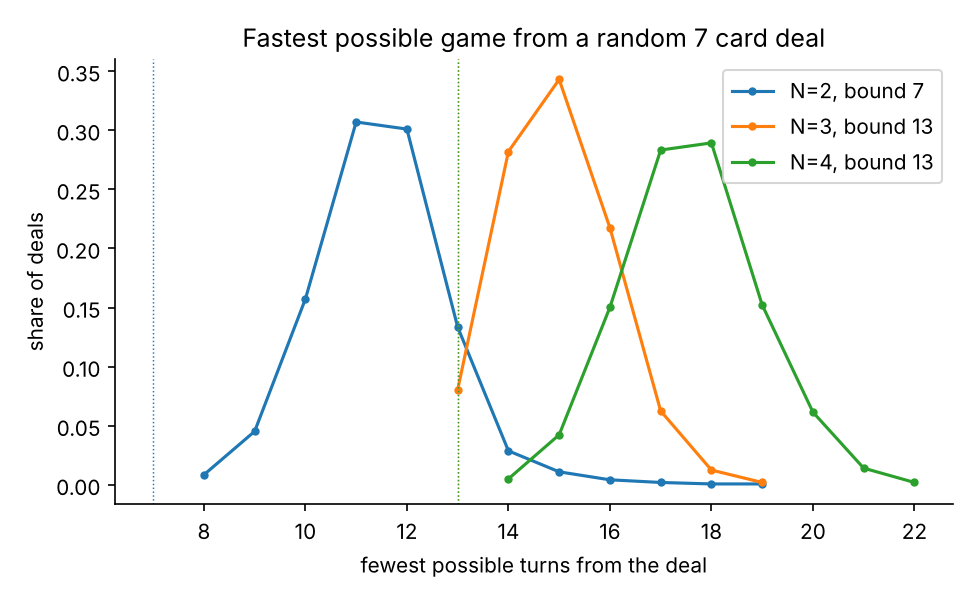
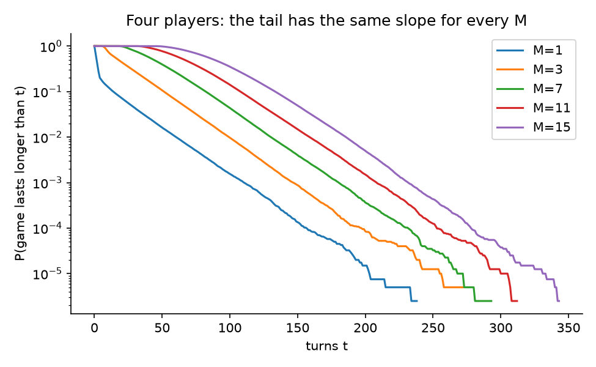
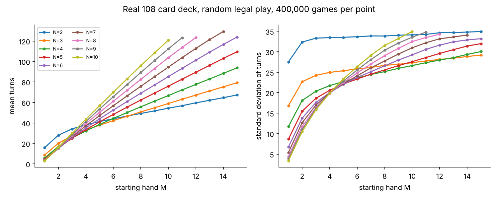
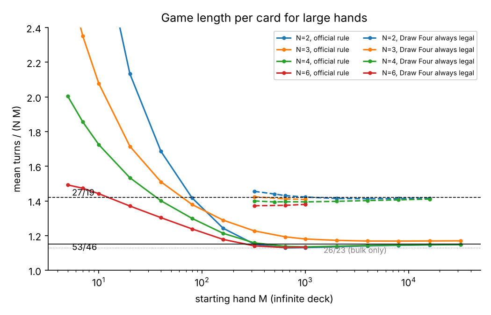
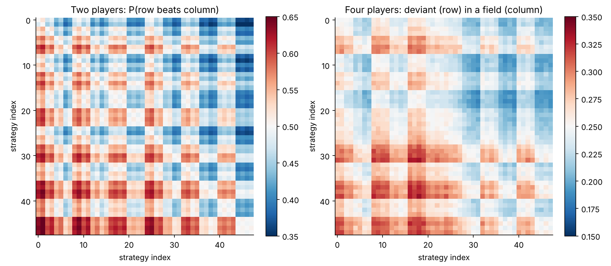

# Uno: how short, how long, and how to play

This folder asks the question from 7 October 2026. Given N players who each start with M cards, what can be said about the shortest game, the longest game and the typical game, and what does game theory say about how to play? Everything here was computed on a laptop with a C engine that plays one round of Uno under the official Mattel rules. Every number below can be regenerated with the commands at the end.

The most interesting finding is in section 4. The length of a game with large hands follows an exact rational law, and the official rule for the Wild Draw Four changes that law in a way that is easy to see once you look for it.

## Rules used

The deck is the standard 108 cards. Each colour has one 0, two each of 1 to 9, and two each of Skip, Reverse and Draw Two, and there are four Wilds and four Wild Draw Fours. A player plays one matching card per turn or draws one card, and plays the drawn card at once if it fits. A Draw Two or Draw Four makes the next player draw and lose their turn. A Reverse acts as a Skip with two players. The Wild Draw Four is legal only when the player holds no card of the current colour, and the engine enforces that instead of modelling challenges. There is no stacking. The starting card is flipped and acts on the first player, and a Wild Draw Four flipped at the start goes back into the stock. When the stock runs out the discard pile is reshuffled. A game ends when the first player goes out, and "turns" counts every turn a player actually takes.

The official rules let a player draw instead of playing a card that fits. The simulated players never do this. They always play when they can, so the simulations describe forced play. The shortest-game solver does allow the voluntary draw.

## 1. The shortest game

**The bound.** A player has to play all M cards, one per turn, so the winner takes at least M turns. With two players, every Skip, Reverse, Draw Two and Draw Four gives the turn straight back, so a first player holding M − 1 of them and any last card can win in M turns. With three or more players every play passes the turn to someone else, so at least one other turn falls between two plays by the same player. The winner then needs at least 2M − 1 turns, and the bound is reached when the neighbours relay the turn back with Reverses or Skips.

**What a real deal allows.** The solver in `engine/shortest.c` takes a random deal with every hand and the order of the stock known. It lets all players cooperate to end the round as fast as possible, with any player allowed to be the winner, and finds the exact minimum by iterative deepening A* search. A plain breadth-first search in `engine/check_shortest.py` agrees with it on all 145 test deals.

| Players | Cards | Deals | Bound | Mean fastest finish | Range | Share at the bound |
| --- | --- | --- | --- | --- | --- | --- |
| 2 | 3 | 4000 | 3 | 7.08 | 3 to 27 | 2.9% |
| 2 | 5 | 4000 | 5 | 8.95 | 5 to 28 | 0.65% |
| 2 | 7 | 4000 | 7 | 11.47 | 8 to 19 | none |
| 3 | 3 | 4000 | 5 | 7.16 | 5 to 33 | 11.1% |
| 3 | 5 | 2000 | 9 | 10.94 | 9 to 17 | 7.8% |
| 3 | 7 | 2000 | 13 | 14.95 | 13 to 19 | 8.1% |
| 4 | 3 | 4000 | 5 | 8.03 | 5 to 25 | 1.0% |
| 4 | 5 | 1000 | 9 | 12.94 | 9 to 19 | 0.1% |
| 4 | 7 | 1000 | 13 | 17.59 | 14 to 22 | none |

With seven cards and two players the bound of 7 never happened in 4000 deals, because it needs six turn-repeating cards in one hand. Three players reach their bound far more often than two or four. Two neighbours who relay the turn back make it easy, and a three-player deal reaches 2M − 1 in 8% to 11% of cases for every M tested. With five and six players the search hit its node limit on 44 of 400 and 75 of 200 deals, so those results are left out of the table. The solved five-player deals all needed at least 16 turns.



## 2. The longest game

Under the official rules there is no longest game. Any player may draw instead of playing and the discard pile is reshuffled into the stock, so the players can keep a round going for as long as they like.

Forced play is the more interesting case. All 58 million games in the length experiments ended. The length distribution has an exponential tail, so the chance that a game runs past t turns falls like e^(−λt). With four players λ is about 0.048 per turn, one factor of e every 21 turns, and it stays the same for every starting hand from M = 1 to M = 15. The tail belongs to the endgame, when hands are small. A long game is a game stuck in that endgame, so how many cards were dealt does not matter. With seven cards λ is 0.030 for two players and between 0.041 and 0.051 for three to ten.



## 3. The typical game

The grid in `results/e1_grid.txt` covers N = 2 to 10 and M = 1 to 15 with 400,000 games of uniformly random legal play per point. With seven cards the mean is 47 turns for two players, 50 for four and 83 for ten. Beyond the first few cards the mean grows linearly in M. The slope is about 2.6 turns per card for two players and 5.4 for four. The standard deviation hardly moves with M, from about 34 to 35 for two players over the whole range, because most of the randomness comes from the endgame.

Seat order matters and the edge does not wear off as M grows. With four players and seven cards the first player wins 26.0% and the last 24.3%. With ten players it is 11.1% against 9.3%. With small hands the dealer, who sits last, does better than the seat before, because a Reverse flipped at the start gives the dealer the first turn. With ten players and one card each the dealer wins 4.5% against 3.4% for the seat before.



## 4. The large-hand law and the Draw Four hoard

To study large hands the engine has an infinite deck mode in which every card dealt or drawn is an independent random card with the deck's proportions. This removes the 108 card ceiling so that M can grow to thousands.

**The law.** Suppose every player's hand is large, so every turn is a play, and suppose every card a player ever holds is eventually played. Each card held is a Draw Two with probability 8/108 and a Draw Four with probability 4/108. If the players between them receive R penalty cards, then the cards played contain on average (8/108)(NM + R) Draw Twos and (4/108)(NM + R) Draw Fours, and those hand out exactly R cards:

R = 2 · (8/108)(NM + R) + 4 · (4/108)(NM + R) = (8/27)(NM + R).

So R = 8NM/19 and the number of turns is NM + R = (27/19) NM. The constant depends on the deck alone. It holds for every N and for every strategy that plays the hand down evenly.

**The test.** With the Draw Four made legal at any time, so that the assumption holds, the mean of T/(NM) at M = 1000 is 1.4213 ± 0.0008 for two players, against 27/19 = 1.4211. Three, four and six players approach the same value from below, and they sit at 1.409, 1.396 and 1.380 at M = 1000. The gap shrinks as the losers' leftover cards shrink relative to M. A strategy that names its best colour or dumps its action cards first gives 1.41 to 1.43 at M = 1000 as well.

**What the official rule does.** Under the official rule a large hand always holds a card of the current colour, so a Draw Four can never be played and every one a player receives stays in the hand. The same counting with Draw Fours left out gives R = (4/27)(M + R) per player. So each player plays 26M/23 cards in the main phase of the game and ends it holding a hoard of M/23 Draw Fours. The fluid equations in `theory/fluid.py` give exactly these values, and a traced two-player game with M = 1000 shows the winner reaching 41 cards, nearly all Draw Fours, against the predicted 43.

The hoard decides the endgame. Once a player is down to Draw Fours they have no card of the current colour, so each Draw Four is legal, and it makes the next player draw four and miss their turn. With two players the hoarder plays every Draw Four in a row. With an even number of players the players two seats apart take turns dumping, and the players between them are skipped every time and only collect cards. Adding M/23 dumping turns for every two players gives a predicted limit of T/(NM) = 26/23 + 1/46 = 53/46 ≈ 1.152 for every even N.

The simulation agrees with the mechanism and approaches the number slowly. At the end of a two-player game the loser holds 0.235M cards at M = 4000, close to the predicted 5M/23 = 0.217M. With the Draw Four always legal the loser holds 0.020M at M = 4000, and that share keeps falling toward zero, roughly like M^(−0.37) over the range run. The official T/(NM) is 1.129, 1.131, 1.136 and 1.141 at M = 640, 1000, 2000 and 4000 for two players and 1.138, 1.136, 1.139 and 1.142 for four. Both are still rising toward 53/46 at the largest M that was run, so the official limit is a prediction that the data supports and does not yet confirm. Odd N has a different endgame, because the skipped player comes around to the dumper's turn, and its limit is open. The measured value for three players is 1.182 at M = 1000.

A strategy that holds back a class of cards builds a hoard of the same kind. A strategy that holds wilds and saves action cards gives T/(NM) = 0.87 at M = 1000 with the Draw Four free, which is even shorter than the official rule. So the law describes play that keeps the hand balanced, and the Draw Four rule is the one place where the official rules force a hoard on everybody.



## 5. Game theory

The strategy family has five settings: whether to hold wilds back while a coloured card fits, whether to play action cards first or last, whether to name a random colour or the colour held most, whether to hit the next player with Draw Twos, Draw Fours and Skips when they hold two cards or fewer, and whether to prefer cards that keep play in the colour held most. Together they give 48 strategies, including uniform random play.

**Two players.** Every pair was played 80,000 times with seats swapped half the time, which gives a symmetric zero-sum matrix game. Its Nash equilibrium found by linear programming is pure: hold wilds, play action cards first, name your best colour and attack when the opponent is low. It beats random play 62.8% of the time. Playing action cards first matters because with two players every action card is a free extra turn. The single most valuable setting is the colour choice, which on average lifts a strategy from 51% to 58% against random play.

**Four players.** Each strategy was played as a single deviant against a field of three copies of every other strategy, 20,000 games per pair over all four seats. One field is stable: hold wilds, treat action cards like any other card, name your best colour, attack and steer towards your colour. The best deviant against it wins 25.04%, which is a fair share. The two-player equilibrium is not stable here, because it wins only 23.6% as a deviant in that field. Against three random players the stable strategy wins 32.8%. Steering towards your colour helps with four players and costs a little with two.



## Limitations

The simulated players always play when they can, so the length results describe forced play. The strategy family is small and hand built, and a learned policy could do better. The large-hand law is proved for the fluid limit and checked by simulation. The finite-size corrections are not derived, and the even-N official limit of 53/46 has not been reached by any run. The infinite deck is an idealisation, and on the real deck M cannot pass 107/N. The shortest-game solver assumes full information and full cooperation, so it measures what a deal allows, not what happens at a table.

## Reproduce

```bash
cd engine && cc -O3 -o uno uno.c -lm && cc -O3 -o shortest shortest.c
python3 e1_grid.py 400000 > ../results/e1_grid.txt
python3 e2_infinite.py 200000 > ../results/e2_infinite.txt
python3 e3_bigm.py > ../results/e3_bigm.txt
python3 e3b_hugem.py > ../results/e3b_hugem.txt
python3 e4_tournament.py 20000 5000 > ../results/e4_tournament.txt
python3 e5_shortest.py > ../results/e5_shortest.txt
python3 check_shortest.py
cd .. && python3 theory/fluid.py && python3 analysis/figures.py
```
